# Client Mockups Portfolio

A visual gallery of custom, mobile-first responsive website mockups designed and pitched to local businesses. These concepts are built with a focus on high-converting layouts, modern UI/UX principles, and lightning-fast performance.

---

## [Artisan Farmers Market](./artisan-farmers-market/)
A vibrant, community-focused layout designed for local produce markets. Features a clean events calendar, rich photography integration, and clear navigation for both stallholders and visitors.

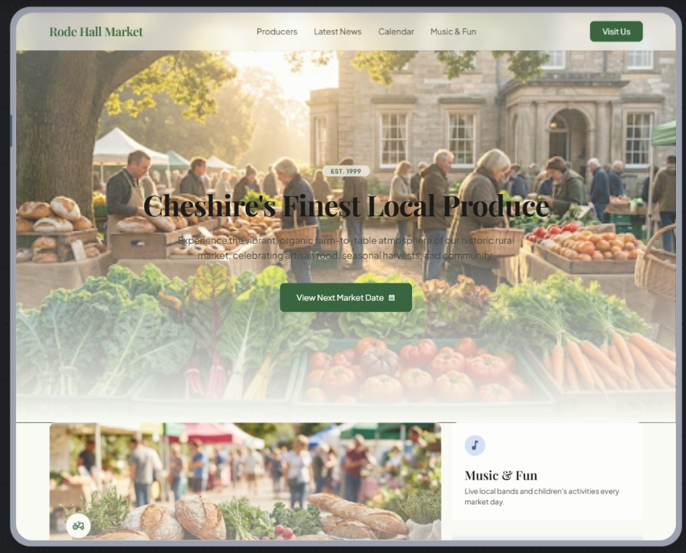
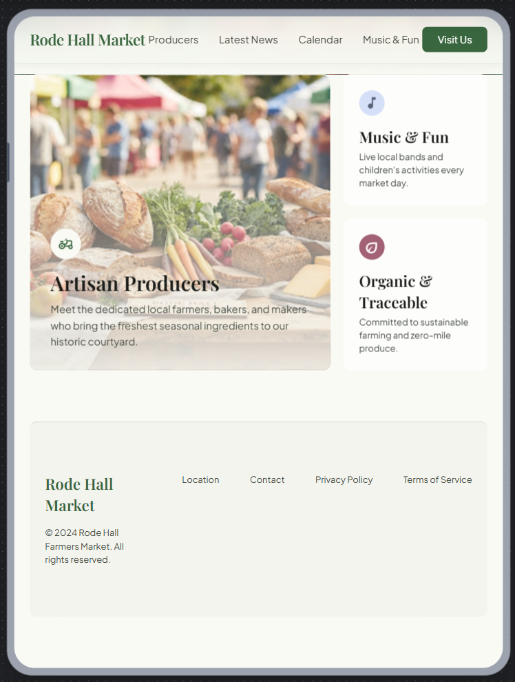
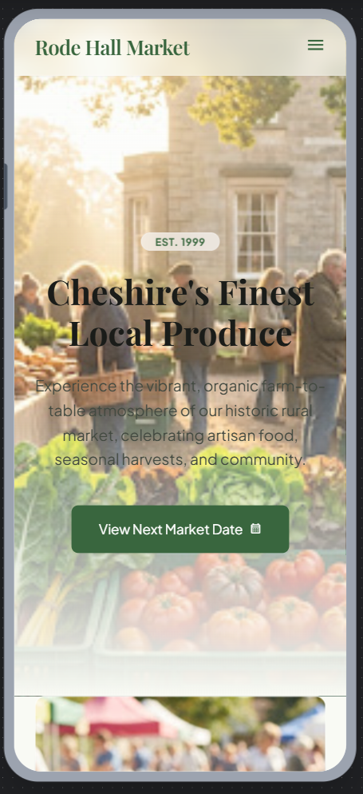

---

## [Multi-Venue Hospitality Group](./multi-venue-hospitality/)
Concept mockup for a regional hospitality group. Unifies multiple venue locations under a premium, dark-mode UI with a clean events and table booking grid.

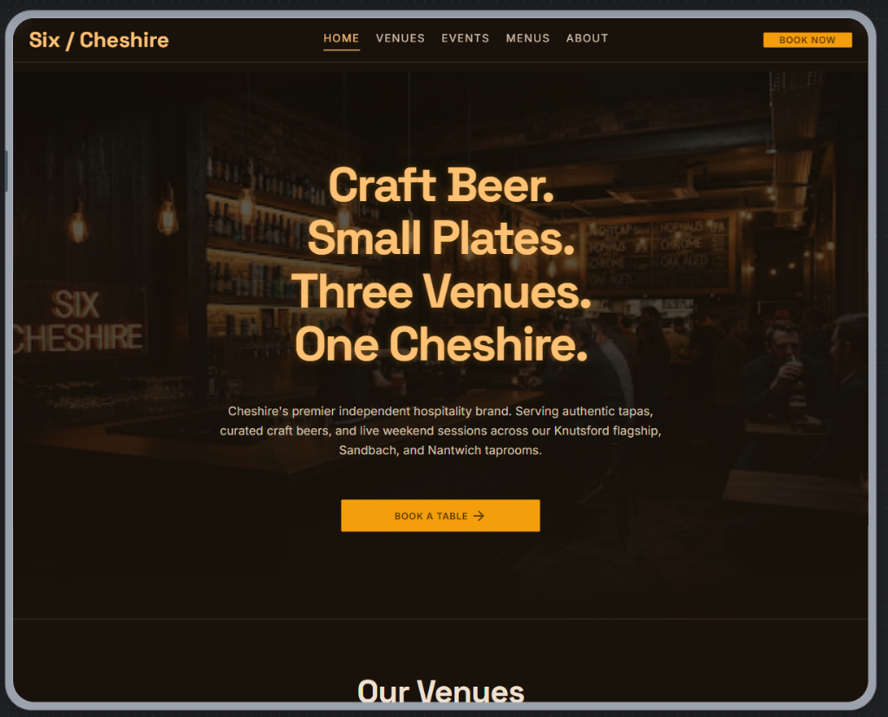
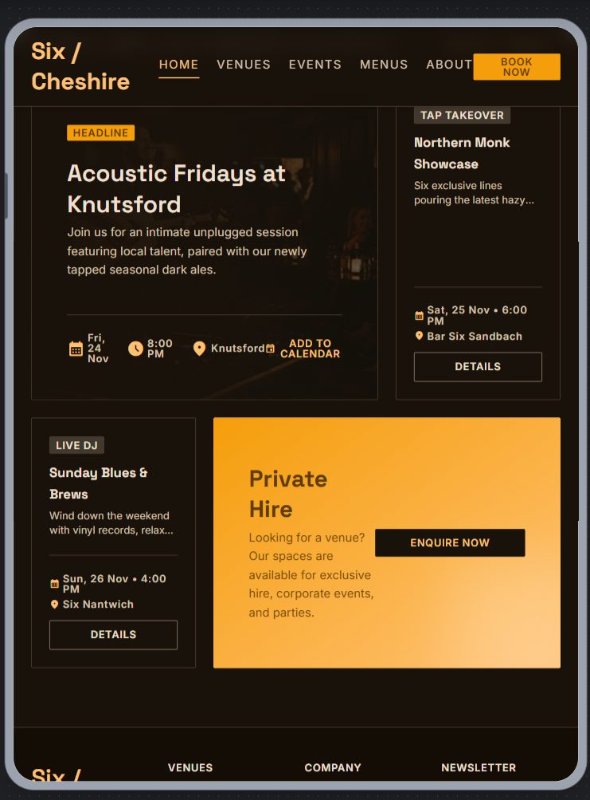
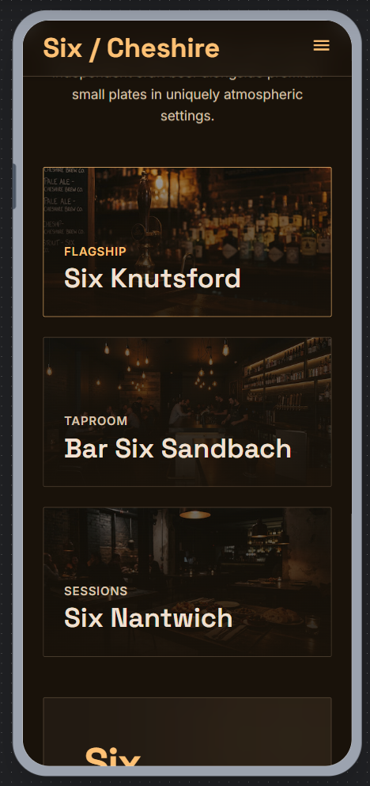

---

## [Country Pub & Restaurant](./country-pub/)
Modernization concept for a local gastro pub. Replaces clunky PDF menus with responsive, tabbed digital menus and prominent call-to-action buttons to drive direct table bookings.

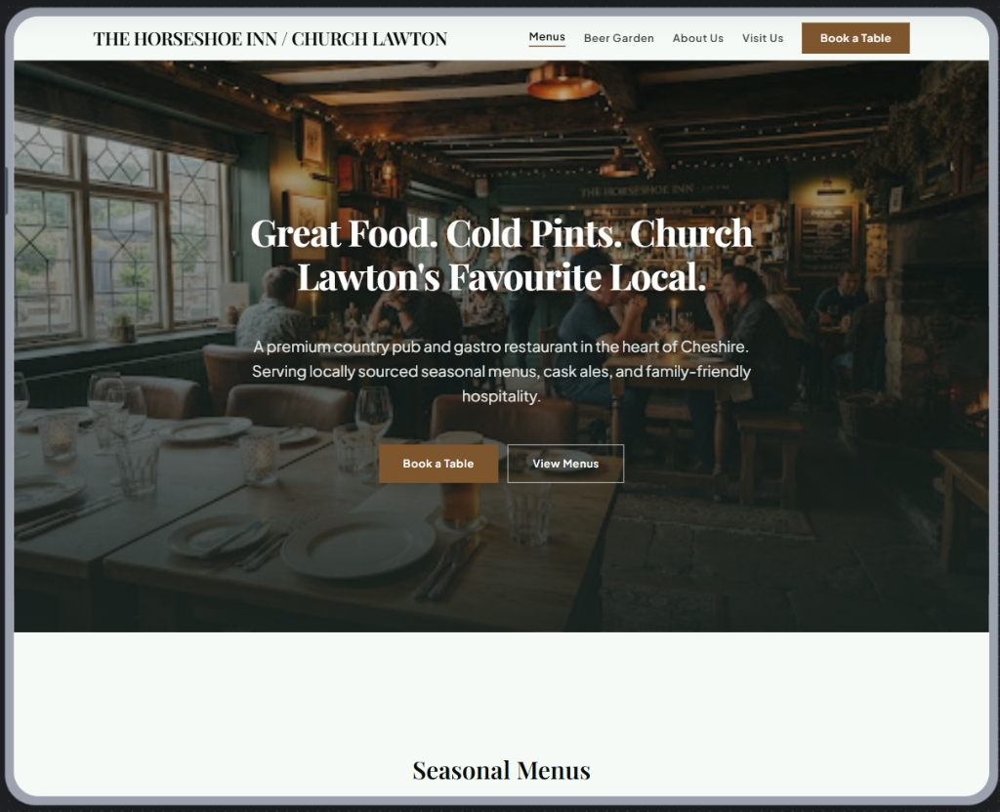
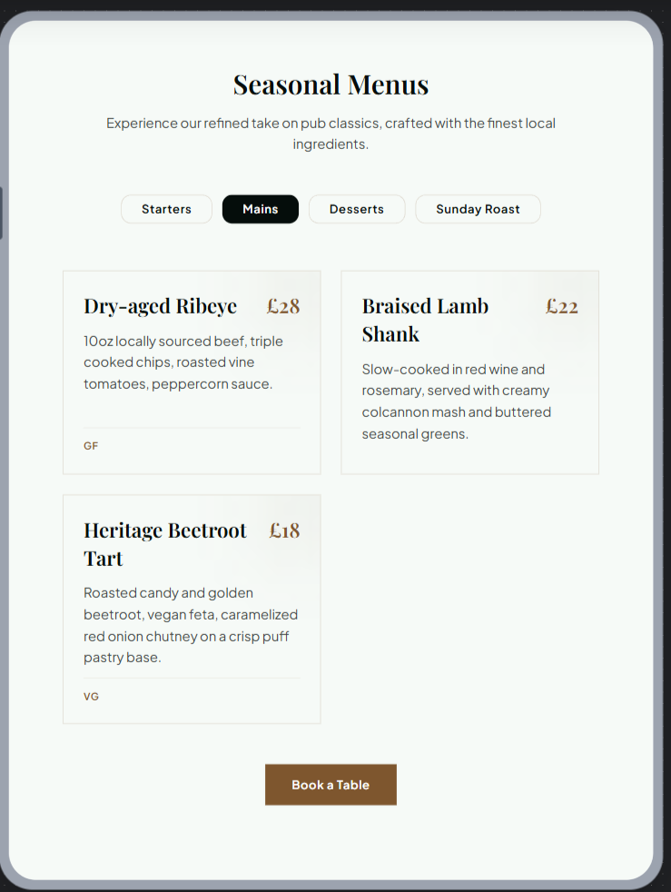
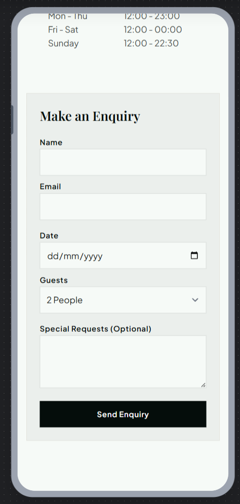

---

## [Local Tradesperson & Landscaping](./local-landscaping/)
Lead-generation site concept for a local tradesperson. Built to transition a business off social media-only marketing by adding a highly professional layout, clear service breakdowns, and direct quote forms.

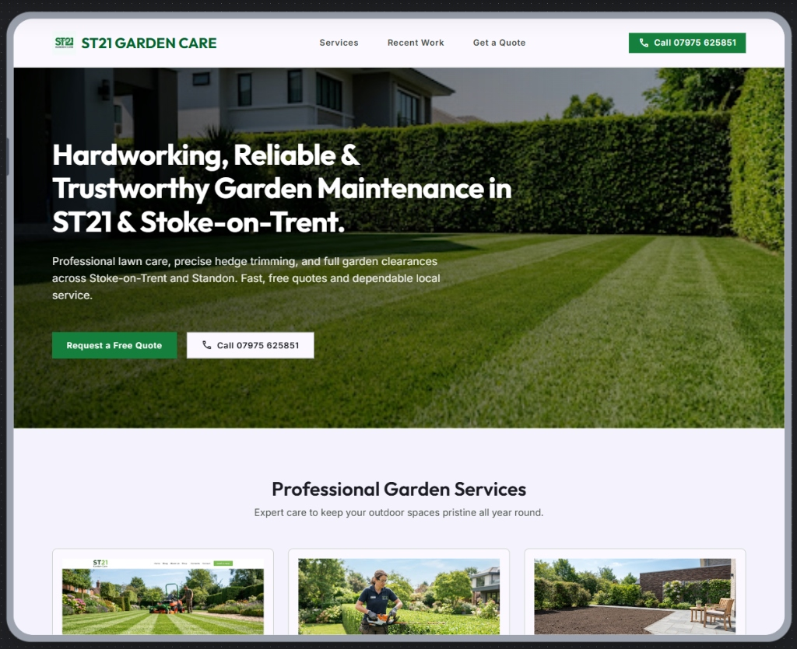
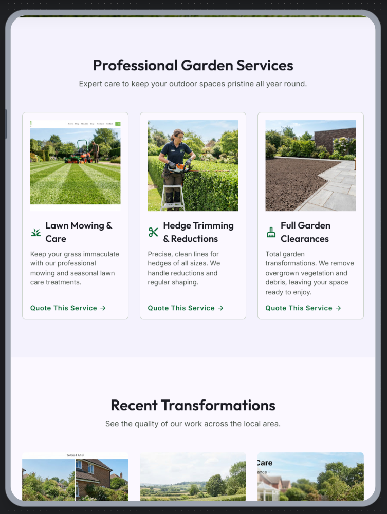
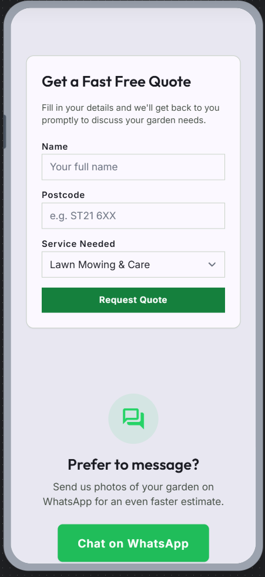

---

## Industry Concept Highlights
A selection of specialized layouts tailored for different local industries.

### Boutique Accountancy Firm
A stunning editorial design using deep colors and crisp typography to project decades of established trust and precision.
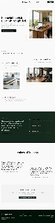

### Commercial Contractors
A high-converting design using a bold, dark industrial theme with vibrant safety-color accents representing heavy-duty reliability.
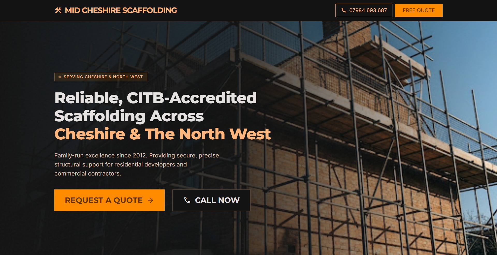

### Custom Tech Lab
A boutique layout specializing in high-performance hardware. Features a premium, dark-mode aesthetic with minimalist layout and clean typography.
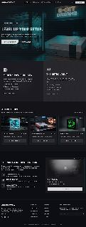
